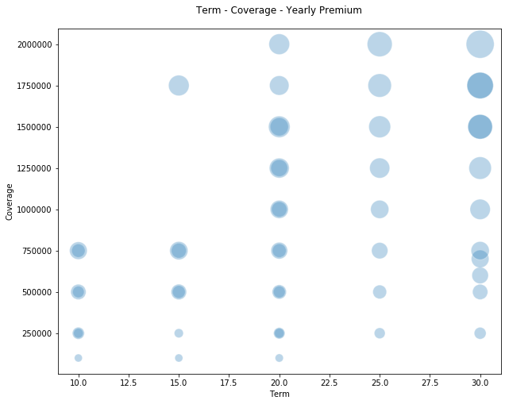
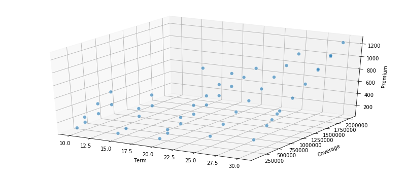
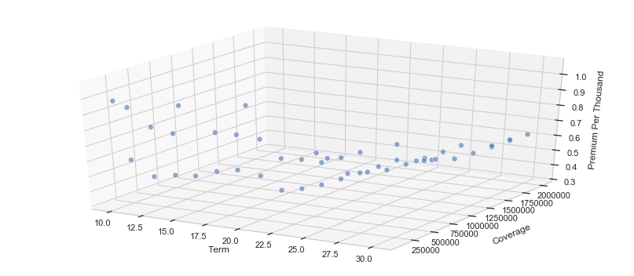
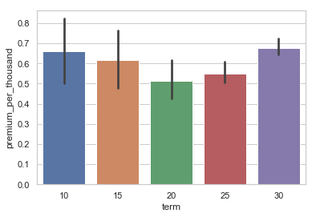

I was married a few years ago and have been trying to be a grown up ever since, I think other people may empathize as there are just so many things to consider.  After working on Wall Street and several FinTech startups spanning personal finance, financial planning, mortgage, and property and casualty insurance.....embarrasingly I didn't ever consider life insurance.  My wife and I realized that we both should have probably gotten some earlier in our lives when things were much cheaper, but better late than never, right?

There are a lot of views on how much life insurance coverage you need, with one quick google search you likely find lots of methods ranging from the extremely simple (i.e. a multiple X age bracket, to more complex cashflow modeling around projected income and/or expenses). For your sake, I'll just keep this post focused the fun data/math things I did :-)

**Full disclaimer here again:** I'm not a life insurance expert, the below was just a fun problem to explore some methods/packages I was unfamiliar with.   

I scraped a bunch of policy quotes and tossed them into a spreadsheet when I noticed something....see below for a glimpse into the dataframe....


<div>
<style scoped>
    .dataframe tbody tr th:only-of-type {
        vertical-align: middle;
    }

    .dataframe tbody tr th {
        vertical-align: top;
    }

    .dataframe thead th {
        text-align: right;
    }
</style>
<table border="1" class="dataframe">
  <thead>
    <tr style="text-align: right;">
      <th></th>
      <th>policy_id</th>
      <th>insurer</th>
      <th>term</th>
      <th>coverage</th>
      <th>yearly_premium</th>
    </tr>
  </thead>
  <tbody>
    <tr>
      <th>0</th>
      <td>1</td>
      <td>Insurer 1</td>
      <td>10</td>
      <td>$100,000</td>
      <td>$98.00</td>
    </tr>
    <tr>
      <th>1</th>
      <td>2</td>
      <td>Insurer 1</td>
      <td>10</td>
      <td>$250,000</td>
      <td>$143.00</td>
    </tr>
    <tr>
      <th>2</th>
      <td>3</td>
      <td>Insurer 2</td>
      <td>10</td>
      <td>$250,000</td>
      <td>$228.00</td>
    </tr>
    <tr>
      <th>3</th>
      <td>4</td>
      <td>Insurer 1</td>
      <td>10</td>
      <td>$500,000</td>
      <td>$205.00</td>
    </tr>
    <tr>
      <th>4</th>
      <td>5</td>
      <td>Insurer 2</td>
      <td>10</td>
      <td>$500,000</td>
      <td>$370.00</td>
    </tr>
  </tbody>
</table>
</div>
I started to wonder if this could be viewed as potential portfolio consisting of optimal terms, coverage amounts, and of course pricing.

Taking a deeper look at a few plots you start to see how these 3 paramaters have some interesting relationships; leading me to conclude that perhaps there could be a potential optimum portfolio of coverages.


```python
plt.figure(figsize=(10, 8))
plt.scatter(x = df_matrix['term'], 
            y = df_matrix['coverage'], 
            s = df_matrix['yearly_premium'],
            alpha=0.3, 
            edgecolors='w',)

plt.xlabel('Term')
plt.ylabel('Coverage')
plt.title('Term - Coverage - Yearly Premium', y=1.03)
```




The above plot is pretty, but perhaps not very intuitive. When we try a more explicit 3-diminesional plot it starts to get real interesting as you can visualize some real linear relationships here!  


```python
fig = plt.figure(figsize=(14, 6))
ax = fig.add_subplot(111, projection='3d')

xs = df_matrix['term']
ys = df_matrix['coverage']
zs = df_matrix['yearly_premium']
ax.scatter(xs, ys, zs, s=50, alpha=0.6, edgecolors='w')

ax.set_xlabel('Term',labelpad=10)
ax.set_ylabel('Coverage',labelpad=15)
ax.set_zlabel('Premium')

plt.show()
```





You can see the linearity is particularly pronounced along coverage amounts and premium, which is intuitive (equally important is that it is good sanity check on the data).  Let's create a new metric around premium per unit of coverage ($1,000) that helps us understand if something is "cheap" or "expensive" across these parameters.  You probably see where we are headed, but let's just flush this out a bit more with some intuition before we get to the fun programming....


```python
# Let's create a new metric
df_matrix['premium_per_thousand']=(df_matrix.yearly_premium/df_matrix.coverage)*1000
```


```python
fig = plt.figure(figsize=(14, 6))
ax = fig.add_subplot(111, projection='3d')

xs = df_matrix['term']
ys = df_matrix['coverage']
zs = df_matrix['premium_per_thousand']
ax.scatter(xs, ys, zs, s=50, alpha=0.6, edgecolors='w')

ax.set_xlabel('Term',labelpad=10)
ax.set_ylabel('Coverage',labelpad=15)
ax.set_zlabel('Premium')

plt.show()
```




The above plot isn't really that helpful, so let's try another view as it seems that these relationships vary a great deal according to the term.

```python
sns.set(style="whitegrid")
ax = sns.barplot(x=df_matrix.term.astype('str'), y=df_matrix.premium_per_thousand)
```




Ok, here we go, we can see here that it appears that premium per $1k of coverage is more expensive at shorter terms and longer terms.  I speculate that shorter terms have some fixed transactional costs in them and longer terms are more expensive simply due to the fact that the longer the term the higher likelyhood of an event happening during that term period.


```python
df_matrix.head(2)
```
Glimpsing at our dataframe below, we can see our premium_per_thousand metric.  If we know exactly the term we want and have a coverage amount range (and assume all insurers to be equal); we now have a metric that enables us to select the most attractively priced policy.  It's simple and elegant without a lot of complicated data science and math methods/tooling.  


<div>
<style scoped>
    .dataframe tbody tr th:only-of-type {
        vertical-align: middle;
    }

    .dataframe tbody tr th {
        vertical-align: top;
    }

    .dataframe thead th {
        text-align: right;
    }
</style>
<table border="1" class="dataframe">
  <thead>
    <tr style="text-align: right;">
      <th></th>
      <th>policy_id</th>
      <th>insurer</th>
      <th>term</th>
      <th>coverage</th>
      <th>yearly_premium</th>
      <th>monthly_premium</th>
      <th>premium_per_thousand</th>
    </tr>
  </thead>
  <tbody>
    <tr>
      <th>0</th>
      <td>1</td>
      <td>Insurer 1</td>
      <td>10</td>
      <td>100000.0</td>
      <td>98.0</td>
      <td>8.166667</td>
      <td>0.980</td>
    </tr>
    <tr>
      <th>1</th>
      <td>2</td>
      <td>Insurer 1</td>
      <td>10</td>
      <td>250000.0</td>
      <td>143.0</td>
      <td>11.916667</td>
      <td>0.572</td>
    </tr>
  </tbody>
</table>
</div>

**Full disclaimer here again:** I'm not a life insurance expert, the below was just a fun problem to explore some methods/packages I was unfamiliar with. This isn't a recommendation on selecting life insurance.   

What if we were flexible in terms of the amount of coverage we needed and the term profile?  Also what if there were hypothetical instances where we can construct mult-policy portfolios with varying coverage amounts and terms over time but weighted averages that are similar to individual policies at a more attractive cost?

Hypothetical scenario: 
I'm interested in Policy A which has a 20 year term and for $1 million dollars of coverage our premium is $2000 per year

Policy B has a 10 year term and for $500k of coverage our premium is $300 per year
Policy C has a 30 year term and for $500k of coverage our premium is $1300 per year

If I purchase policy B & C:
$500k+$500k = $1 million of coverage (for the first 10 years of course then slides to $500k)
($500k*10+$500k*30)/($500k+$500k) = 20 years of average coverage
$300+$1300  = $1600 per year

Let's say that I really only wanted $1 million of coverage for the first 10 but wanted to lock in some coverage over 30 years.

The above might be a fun way to explore/refresh  [Linear Programming/Optimization](https://en.wikipedia.org/wiki/Linear_programming) in python.  Linear programming is one of the simplest ways to perform optimization (often overlooked) and is often used across many business lines. This is often used in business operations to help evaluate the trade-offs between cost and efficiency(throuput) with very complicated contraints and dependencies.  I personally used this approach in optimizing call center operations where there were varying constraints on types of headcount, hours of operation, etc that really had implications on the quality of the customer experience.

Let's take a look at our problem, evaluating our goal or metric we're trying to optimize which here is our price (premium); often referred to as our objective function.  Next thing we need are to explicitly state our constraints, for example we'd want a minimum average term period of 30 years and a minimum of $1.5 million of coverage.

Next I found a python [pulp package](https://pythonhosted.org/PuLP/), which has some pretty good documentation.

Here we go:


```python
df_matrix['cov_x_term']=(df_matrix.coverage * df_matrix.term)
```

```python
# Create a list of the insurance items, terms, coverage, premiums, etc.
insurance_items = list(df_matrix['policy_id'])
term = dict(zip(insurance_items,df_matrix['term']))
coverage = dict(zip(insurance_items,df_matrix['coverage']))
yearly_premium = dict(zip(insurance_items,df_matrix['yearly_premium']))
cov_x_term = dict(zip(insurance_items,df_matrix['cov_x_term']))
```


```python
df_matrix.head(15)
```


<div>
<style scoped>
    .dataframe tbody tr th:only-of-type {
        vertical-align: middle;
    }

    .dataframe tbody tr th {
        vertical-align: top;
    }

    .dataframe thead th {
        text-align: right;
    }
</style>
<table border="1" class="dataframe">
  <thead>
    <tr style="text-align: right;">
      <th></th>
      <th>policy_id</th>
      <th>insurer</th>
      <th>term</th>
      <th>coverage</th>
      <th>yearly_premium</th>
      <th>monthly_premium</th>
      <th>premium_per_thousand</th>
      <th>cov_x_term</th>
    </tr>
  </thead>
  <tbody>
    <tr>
      <th>0</th>
      <td>1</td>
      <td>Insurer 1</td>
      <td>10</td>
      <td>100000.0</td>
      <td>98.0</td>
      <td>8.166667</td>
      <td>0.980000</td>
      <td>1000000.0</td>
    </tr>
    <tr>
      <th>1</th>
      <td>2</td>
      <td>Insurer 1</td>
      <td>10</td>
      <td>250000.0</td>
      <td>143.0</td>
      <td>11.916667</td>
      <td>0.572000</td>
      <td>2500000.0</td>
    </tr>
    <tr>
      <th>2</th>
      <td>3</td>
      <td>Insurer 2</td>
      <td>10</td>
      <td>250000.0</td>
      <td>228.0</td>
      <td>19.000000</td>
      <td>0.912000</td>
      <td>2500000.0</td>
    </tr>
    <tr>
      <th>3</th>
      <td>4</td>
      <td>Insurer 1</td>
      <td>10</td>
      <td>500000.0</td>
      <td>205.0</td>
      <td>17.083333</td>
      <td>0.410000</td>
      <td>5000000.0</td>
    </tr>
    <tr>
      <th>4</th>
      <td>5</td>
      <td>Insurer 2</td>
      <td>10</td>
      <td>500000.0</td>
      <td>370.0</td>
      <td>30.833333</td>
      <td>0.740000</td>
      <td>5000000.0</td>
    </tr>
    <tr>
      <th>5</th>
      <td>6</td>
      <td>Insurer 1</td>
      <td>10</td>
      <td>750000.0</td>
      <td>277.0</td>
      <td>23.083333</td>
      <td>0.369333</td>
      <td>7500000.0</td>
    </tr>
    <tr>
      <th>6</th>
      <td>7</td>
      <td>Insurer 3</td>
      <td>10</td>
      <td>750000.0</td>
      <td>488.0</td>
      <td>40.666667</td>
      <td>0.650667</td>
      <td>7500000.0</td>
    </tr>
    <tr>
      <th>7</th>
      <td>8</td>
      <td>Insurer 1</td>
      <td>15</td>
      <td>100000.0</td>
      <td>100.0</td>
      <td>8.333333</td>
      <td>1.000000</td>
      <td>1500000.0</td>
    </tr>
    <tr>
      <th>8</th>
      <td>9</td>
      <td>Insurer 1</td>
      <td>15</td>
      <td>250000.0</td>
      <td>130.0</td>
      <td>10.833333</td>
      <td>0.520000</td>
      <td>3750000.0</td>
    </tr>
    <tr>
      <th>9</th>
      <td>10</td>
      <td>Insurer 1</td>
      <td>15</td>
      <td>500000.0</td>
      <td>250.0</td>
      <td>20.833333</td>
      <td>0.500000</td>
      <td>7500000.0</td>
    </tr>
    <tr>
      <th>10</th>
      <td>11</td>
      <td>Insurer 3</td>
      <td>15</td>
      <td>500000.0</td>
      <td>378.0</td>
      <td>31.500000</td>
      <td>0.756000</td>
      <td>7500000.0</td>
    </tr>
    <tr>
      <th>11</th>
      <td>12</td>
      <td>Insurer 1</td>
      <td>15</td>
      <td>750000.0</td>
      <td>345.0</td>
      <td>28.750000</td>
      <td>0.460000</td>
      <td>11250000.0</td>
    </tr>
    <tr>
      <th>12</th>
      <td>13</td>
      <td>Insurer 3</td>
      <td>15</td>
      <td>750000.0</td>
      <td>521.0</td>
      <td>43.416667</td>
      <td>0.694667</td>
      <td>11250000.0</td>
    </tr>
    <tr>
      <th>13</th>
      <td>14</td>
      <td>Insurer 1</td>
      <td>15</td>
      <td>1750000.0</td>
      <td>666.0</td>
      <td>55.500000</td>
      <td>0.380571</td>
      <td>26250000.0</td>
    </tr>
    <tr>
      <th>14</th>
      <td>15</td>
      <td>Insurer 1</td>
      <td>20</td>
      <td>100000.0</td>
      <td>105.0</td>
      <td>8.750000</td>
      <td>1.050000</td>
      <td>2000000.0</td>
    </tr>
  </tbody>
</table>
</div>


### Let's Try To Solve With Linear/Integer Programming


```python
from pulp import *
```


```python
min_avg_term = 30
min_tot_cov = 1500000
```


```python
prob = LpProblem("Insurance Problem",LpMinimize)
insurance_vars = LpVariable.dicts("Life",insurance_items,0,cat='Integer')
```


```python
#Next, we start building the LP problem by adding the main objective function. Note the use of thelpSum method.
prob += lpSum([yearly_premium[i]*insurance_vars[i] for i in insurance_items])

#Minimum Total Coverage
prob += lpSum([coverage[f] * insurance_vars[f] for f in insurance_items]) >= min_tot_cov, "MinimumTotalCoverage"

#Minimum Average Term
prob += lpSum([cov_x_term[f] * insurance_vars[f] for f in insurance_items]) >= min_avg_term*(lpSum([coverage[f] * insurance_vars[f] for f in insurance_items])), "MinimumAvgDuration"

prob.solve()

print("Status:", LpStatus[prob.status])
```

    Status: Optimal


```python
#Now we have a dictionary that has a series of variables and an optimal set of weights for example
print (prob.variables()[3].varValue)
```    0.0


```python
#Let's grab all the weights and put them into a dataframe so we can easily take a look 
weights_dict = {} 
pricing_dict = {}

weights_dict={}
for v in prob.variables():
    weights_dict.update({v.name[5:]:v.varValue})
```


```python
weights_df = pd.DataFrame(weights_dict,index=[0]).transpose()
weights_df.reset_index(inplace=True)
weights_df.rename(columns={'index':'policy_id',0:'weights'},inplace=True)
```


```python
#formatting these fields so we can compare them to the original matrix
weights_df.policy_id = weights_df.policy_id.apply(lambda l: float(l))
weights_df.weights = weights_df.weights.apply(lambda l: float(l))
```


```python
weights_df.info()
```

    <class 'pandas.core.frame.DataFrame'>
    RangeIndex: 49 entries, 0 to 48
    Data columns (total 2 columns):
    policy_id    49 non-null float64
    weights      49 non-null float64
    dtypes: float64(2)
    memory usage: 864.0 bytes


```python
weights_df[weights_df.weights>0.0]
```


<div>
<style scoped>
    .dataframe tbody tr th:only-of-type {
        vertical-align: middle;
    }

    .dataframe tbody tr th {
        vertical-align: top;
    }

    .dataframe thead th {
        text-align: right;
    }
</style>
<table border="1" class="dataframe">
  <thead>
    <tr style="text-align: right;">
      <th></th>
      <th>policy_id</th>
      <th>weights</th>
    </tr>
  </thead>
  <tbody>
    <tr>
      <th>39</th>
      <td>45.0</td>
      <td>1.0</td>
    </tr>
  </tbody>
</table>
</div>
We only have 1 policy that has a weight equal to 1 for a minimum average term of 30 years and $1.5 Million of Coverage. Appears that for these constraints, this policy is optimally priced.


```python
df_scenario = df_matrix.merge(weights_df,how='left',on='policy_id')
```


```python
df_scenario.tail()
```


<div>
<style scoped>
    .dataframe tbody tr th:only-of-type {
        vertical-align: middle;
    }

    .dataframe tbody tr th {
        vertical-align: top;
    }

    .dataframe thead th {
        text-align: right;
    }
</style>
<table border="1" class="dataframe">
  <thead>
    <tr style="text-align: right;">
      <th></th>
      <th>policy_id</th>
      <th>insurer</th>
      <th>term</th>
      <th>coverage</th>
      <th>yearly_premium</th>
      <th>monthly_premium</th>
      <th>premium_per_thousand</th>
      <th>cov_x_term</th>
      <th>weights</th>
    </tr>
  </thead>
  <tbody>
    <tr>
      <th>44</th>
      <td>45</td>
      <td>Insurer 1</td>
      <td>30</td>
      <td>1500000.0</td>
      <td>941.0</td>
      <td>78.416667</td>
      <td>0.627333</td>
      <td>45000000.0</td>
      <td>1.0</td>
    </tr>
    <tr>
      <th>45</th>
      <td>46</td>
      <td>Insurer 2</td>
      <td>30</td>
      <td>1500000.0</td>
      <td>955.0</td>
      <td>79.583333</td>
      <td>0.636667</td>
      <td>45000000.0</td>
      <td>0.0</td>
    </tr>
    <tr>
      <th>46</th>
      <td>47</td>
      <td>Insurer 1</td>
      <td>30</td>
      <td>1750000.0</td>
      <td>1087.0</td>
      <td>90.583333</td>
      <td>0.621143</td>
      <td>52500000.0</td>
      <td>0.0</td>
    </tr>
    <tr>
      <th>47</th>
      <td>48</td>
      <td>Insurer 2</td>
      <td>30</td>
      <td>1750000.0</td>
      <td>1100.0</td>
      <td>91.666667</td>
      <td>0.628571</td>
      <td>52500000.0</td>
      <td>0.0</td>
    </tr>
    <tr>
      <th>48</th>
      <td>49</td>
      <td>Insurer 2</td>
      <td>30</td>
      <td>2000000.0</td>
      <td>1234.0</td>
      <td>102.833333</td>
      <td>0.617000</td>
      <td>60000000.0</td>
      <td>0.0</td>
    </tr>
  </tbody>
</table>
</div>


```python
df_scenario[df_scenario.weights>0.0]
```


<div>
<style scoped>
    .dataframe tbody tr th:only-of-type {
        vertical-align: middle;
    }

    .dataframe tbody tr th {
        vertical-align: top;
    }

    .dataframe thead th {
        text-align: right;
    }
</style>
<table border="1" class="dataframe">
  <thead>
    <tr style="text-align: right;">
      <th></th>
      <th>policy_id</th>
      <th>insurer</th>
      <th>term</th>
      <th>coverage</th>
      <th>yearly_premium</th>
      <th>monthly_premium</th>
      <th>premium_per_thousand</th>
      <th>cov_x_term</th>
      <th>weights</th>
    </tr>
  </thead>
  <tbody>
    <tr>
      <th>44</th>
      <td>45</td>
      <td>Insurer 1</td>
      <td>30</td>
      <td>1500000.0</td>
      <td>941.0</td>
      <td>78.416667</td>
      <td>0.627333</td>
      <td>45000000.0</td>
      <td>1.0</td>
    </tr>
  </tbody>
</table>
</div>


Perhaps let's look at a few different scenarios of coverage and term, it's highly likely that the common policy terms 10,20,30 are likely optimally priced.  So perhaps looking at some potential terms in the middle may yield some fruit from using our integer programming technique/tool.


```python
# coverage
min_cov_array = [750000,1000000,1250000,1500000,1750000,2000000]
min_term_array = [15,20,23,25,27]
```

```python
num_scenarios = len(min_cov_array)*len(min_term_array)

weights_dict = {} 
pricing_dict = {}

df_scenario = pd.DataFrame()
df_final_scenario_policy_weights = pd.DataFrame() 
df_final_summary = pd.DataFrame()

#min_avg_term = 25.0
for min_avg_term in min_term_array:
    #Can break below into sub_function
    for min_tot_cov in min_cov_array:
        #keep data on each run remember scenario for min_avg_term
        
        prob = LpProblem("Insurance Problem",LpMinimize)
        insurance_vars = LpVariable.dicts("Life",insurance_items,0,cat='Integer')

        prob += lpSum([yearly_premium[i]*insurance_vars[i] for i in insurance_items])
        prob += lpSum([coverage[f] * insurance_vars[f] for f in insurance_items]) >= min_tot_cov, "MinimumTotalCoverage"
        prob += lpSum([cov_x_term[f] * insurance_vars[f] for f in insurance_items]) >= min_avg_term*(lpSum([coverage[f] * insurance_vars[f] for f in insurance_items])), "MinimumAvgDuration"
        prob.solve()

        weights_dict[f'{min_avg_term}_{min_tot_cov:}']={}
        for v in prob.variables():
            weights_dict[f'{min_avg_term}_{min_tot_cov:}'].update({v.name[5:]:v.varValue})            

    #write all this into dataframe
    weights_df = pd.DataFrame(weights_dict)
    weights_df.reset_index(inplace=True)
    weights_df.rename(columns={'index':'policy_id'},inplace=True)
    
    weights_df['policy_id'] = weights_df['policy_id'].astype('int64')

    df_scenario = df_matrix.merge(weights_df,how='left',on='policy_id')
    
```


```python
num_scenarios
```


    30


```python
weights_df.shape
```


    (49, 31)


```python
df_scenario.head(5)
```


<div>
<style scoped>
    .dataframe tbody tr th:only-of-type {
        vertical-align: middle;
    }

    .dataframe tbody tr th {
        vertical-align: top;
    }

    .dataframe thead th {
        text-align: right;
    }
</style>
<table border="1" class="dataframe">
  <thead>
    <tr style="text-align: right;">
      <th></th>
      <th>policy_id</th>
      <th>insurer</th>
      <th>term</th>
      <th>coverage</th>
      <th>yearly_premium</th>
      <th>monthly_premium</th>
      <th>premium_per_thousand</th>
      <th>cov_x_term</th>
      <th>15_750000</th>
      <th>15_1000000</th>
      <th>...</th>
      <th>25_1250000</th>
      <th>25_1500000</th>
      <th>25_1750000</th>
      <th>25_2000000</th>
      <th>27_750000</th>
      <th>27_1000000</th>
      <th>27_1250000</th>
      <th>27_1500000</th>
      <th>27_1750000</th>
      <th>27_2000000</th>
    </tr>
  </thead>
  <tbody>
    <tr>
      <th>0</th>
      <td>1</td>
      <td>Insurer 1</td>
      <td>10</td>
      <td>100000.0</td>
      <td>98.0</td>
      <td>8.166667</td>
      <td>0.980</td>
      <td>1000000.0</td>
      <td>0.0</td>
      <td>0.0</td>
      <td>...</td>
      <td>0.0</td>
      <td>0.0</td>
      <td>0.0</td>
      <td>0.0</td>
      <td>0.0</td>
      <td>0.0</td>
      <td>0.0</td>
      <td>0.0</td>
      <td>0.0</td>
      <td>0.0</td>
    </tr>
    <tr>
      <th>1</th>
      <td>2</td>
      <td>Insurer 1</td>
      <td>10</td>
      <td>250000.0</td>
      <td>143.0</td>
      <td>11.916667</td>
      <td>0.572</td>
      <td>2500000.0</td>
      <td>0.0</td>
      <td>0.0</td>
      <td>...</td>
      <td>0.0</td>
      <td>0.0</td>
      <td>0.0</td>
      <td>0.0</td>
      <td>0.0</td>
      <td>0.0</td>
      <td>0.0</td>
      <td>0.0</td>
      <td>0.0</td>
      <td>0.0</td>
    </tr>
    <tr>
      <th>2</th>
      <td>3</td>
      <td>Insurer 2</td>
      <td>10</td>
      <td>250000.0</td>
      <td>228.0</td>
      <td>19.000000</td>
      <td>0.912</td>
      <td>2500000.0</td>
      <td>0.0</td>
      <td>0.0</td>
      <td>...</td>
      <td>0.0</td>
      <td>0.0</td>
      <td>0.0</td>
      <td>0.0</td>
      <td>0.0</td>
      <td>0.0</td>
      <td>0.0</td>
      <td>0.0</td>
      <td>0.0</td>
      <td>0.0</td>
    </tr>
    <tr>
      <th>3</th>
      <td>4</td>
      <td>Insurer 1</td>
      <td>10</td>
      <td>500000.0</td>
      <td>205.0</td>
      <td>17.083333</td>
      <td>0.410</td>
      <td>5000000.0</td>
      <td>0.0</td>
      <td>0.0</td>
      <td>...</td>
      <td>0.0</td>
      <td>0.0</td>
      <td>0.0</td>
      <td>0.0</td>
      <td>0.0</td>
      <td>0.0</td>
      <td>0.0</td>
      <td>0.0</td>
      <td>0.0</td>
      <td>0.0</td>
    </tr>
    <tr>
      <th>4</th>
      <td>5</td>
      <td>Insurer 2</td>
      <td>10</td>
      <td>500000.0</td>
      <td>370.0</td>
      <td>30.833333</td>
      <td>0.740</td>
      <td>5000000.0</td>
      <td>0.0</td>
      <td>0.0</td>
      <td>...</td>
      <td>0.0</td>
      <td>0.0</td>
      <td>0.0</td>
      <td>0.0</td>
      <td>0.0</td>
      <td>0.0</td>
      <td>0.0</td>
      <td>0.0</td>
      <td>0.0</td>
      <td>0.0</td>
    </tr>
  </tbody>
</table>
<p>5 rows × 38 columns</p>
</div>


```python
# for a more convenient view let's only keep the policies that have weights > 0
df_scenario.shape
```


    (49, 38)


```python
## for illustrative purposes I'm copying this over to a separate dataframe, with large datasets this is not recommended. 
df_weighted = df_scenario[(df_scenario.iloc[:,-num_scenarios:]!=0).any(axis=1)]
df_weighted = df_weighted.copy()
```


```python
df_weighted.shape
```


    (19, 38)


```python
# can see your composition of policies for each optimized scenario
df_weighted.head(5)
```


<div>
<style scoped>
    .dataframe tbody tr th:only-of-type {
        vertical-align: middle;
    }

    .dataframe tbody tr th {
        vertical-align: top;
    }

    .dataframe thead th {
        text-align: right;
    }
</style>
<table border="1" class="dataframe">
  <thead>
    <tr style="text-align: right;">
      <th></th>
      <th>policy_id</th>
      <th>insurer</th>
      <th>term</th>
      <th>coverage</th>
      <th>yearly_premium</th>
      <th>monthly_premium</th>
      <th>premium_per_thousand</th>
      <th>cov_x_term</th>
      <th>15_750000</th>
      <th>15_1000000</th>
      <th>...</th>
      <th>25_1250000</th>
      <th>25_1500000</th>
      <th>25_1750000</th>
      <th>25_2000000</th>
      <th>27_750000</th>
      <th>27_1000000</th>
      <th>27_1250000</th>
      <th>27_1500000</th>
      <th>27_1750000</th>
      <th>27_2000000</th>
    </tr>
  </thead>
  <tbody>
    <tr>
      <th>8</th>
      <td>9</td>
      <td>Insurer 1</td>
      <td>15</td>
      <td>250000.0</td>
      <td>130.0</td>
      <td>10.833333</td>
      <td>0.520000</td>
      <td>3750000.0</td>
      <td>0.0</td>
      <td>0.0</td>
      <td>...</td>
      <td>0.0</td>
      <td>0.0</td>
      <td>0.0</td>
      <td>0.0</td>
      <td>0.0</td>
      <td>0.0</td>
      <td>1.0</td>
      <td>1.0</td>
      <td>0.0</td>
      <td>0.0</td>
    </tr>
    <tr>
      <th>17</th>
      <td>18</td>
      <td>Insurer 1</td>
      <td>20</td>
      <td>500000.0</td>
      <td>215.0</td>
      <td>17.916667</td>
      <td>0.430000</td>
      <td>10000000.0</td>
      <td>0.0</td>
      <td>0.0</td>
      <td>...</td>
      <td>0.0</td>
      <td>0.0</td>
      <td>0.0</td>
      <td>0.0</td>
      <td>0.0</td>
      <td>0.0</td>
      <td>0.0</td>
      <td>0.0</td>
      <td>1.0</td>
      <td>1.0</td>
    </tr>
    <tr>
      <th>19</th>
      <td>20</td>
      <td>Insurer 1</td>
      <td>20</td>
      <td>750000.0</td>
      <td>292.0</td>
      <td>24.333333</td>
      <td>0.389333</td>
      <td>15000000.0</td>
      <td>1.0</td>
      <td>0.0</td>
      <td>...</td>
      <td>0.0</td>
      <td>0.0</td>
      <td>0.0</td>
      <td>0.0</td>
      <td>0.0</td>
      <td>0.0</td>
      <td>0.0</td>
      <td>0.0</td>
      <td>0.0</td>
      <td>0.0</td>
    </tr>
    <tr>
      <th>21</th>
      <td>22</td>
      <td>Insurer 1</td>
      <td>20</td>
      <td>1000000.0</td>
      <td>365.0</td>
      <td>30.416667</td>
      <td>0.365000</td>
      <td>20000000.0</td>
      <td>0.0</td>
      <td>1.0</td>
      <td>...</td>
      <td>0.0</td>
      <td>0.0</td>
      <td>0.0</td>
      <td>0.0</td>
      <td>0.0</td>
      <td>0.0</td>
      <td>0.0</td>
      <td>0.0</td>
      <td>0.0</td>
      <td>0.0</td>
    </tr>
    <tr>
      <th>23</th>
      <td>24</td>
      <td>Insurer 1</td>
      <td>20</td>
      <td>1250000.0</td>
      <td>442.0</td>
      <td>36.833333</td>
      <td>0.353600</td>
      <td>25000000.0</td>
      <td>0.0</td>
      <td>0.0</td>
      <td>...</td>
      <td>0.0</td>
      <td>0.0</td>
      <td>0.0</td>
      <td>0.0</td>
      <td>0.0</td>
      <td>0.0</td>
      <td>0.0</td>
      <td>0.0</td>
      <td>0.0</td>
      <td>0.0</td>
    </tr>
  </tbody>
</table>
<p>5 rows × 38 columns</p>
</div>


If you see below, we do have some scenarios where policies > 1; which indicates that a combination of policies will yield a more optimal price!  

```python
#Quick view of our policies shows that this may be working.
df_weighted.iloc[:,-num_scenarios:].astype(bool).sum()
```


    15_750000     1
    15_1000000    1
    15_1250000    1
    15_1500000    1
    15_1750000    1
    15_2000000    1
    20_750000     1
    20_1000000    1
    20_1250000    1
    20_1500000    1
    20_1750000    1
    20_2000000    1
    23_750000     1
    23_1000000    1
    23_1250000    2
    23_1500000    2
    23_1750000    2
    23_2000000    2
    25_750000     1
    25_1000000    1
    25_1250000    1
    25_1500000    1
    25_1750000    1
    25_2000000    1
    27_750000     1
    27_1000000    1
    27_1250000    2
    27_1500000    2
    27_1750000    2
    27_2000000    2
    dtype: int64


```python
aggregate = {} 
for i in df_weighted.iloc[:,-num_scenarios:].columns:
    aggregate[i]={
                'policy_count':df_weighted[i].astype(bool).sum(),
                'yearly_premium':np.dot(df_weighted.yearly_premium,df_weighted[i]),
                'wa_term':np.dot(df_weighted['cov_x_term'],df_weighted[i])/(np.dot(df_weighted.coverage,df_weighted[i])),
                'total_coverage':np.dot(df_weighted.coverage,df_weighted[i])}
```


```python
#count number of unique policies
df_portfolio_stats = pd.DataFrame(aggregate).transpose()
df_portfolio_stats.index.rename('scenario',inplace=True)
df_portfolio_stats.reset_index(inplace=True)
df_portfolio_stats['min_avg_term']=df_portfolio_stats.scenario.str.split("_",expand=True)[0]
df_portfolio_stats['min_tot_cov']=df_portfolio_stats.scenario.str.split("_",expand=True)[1]
df_portfolio_stats = df_portfolio_stats[['scenario', 'min_avg_term','min_tot_cov','policy_count', 'yearly_premium', 'wa_term','total_coverage']]
```


```python
df_portfolio_stats['premium_per_thousand']=(df_portfolio_stats.yearly_premium/df_portfolio_stats.total_coverage)*1000
```


```python
df_portfolio_stats.head(10)
```


<div>
<style scoped>
    .dataframe tbody tr th:only-of-type {
        vertical-align: middle;
    }

    .dataframe tbody tr th {
        vertical-align: top;
    }

    .dataframe thead th {
        text-align: right;
    }
</style>
<table border="1" class="dataframe">
  <thead>
    <tr style="text-align: right;">
      <th></th>
      <th>scenario</th>
      <th>min_avg_term</th>
      <th>min_tot_cov</th>
      <th>policy_count</th>
      <th>yearly_premium</th>
      <th>wa_term</th>
      <th>total_coverage</th>
      <th>premium_per_thousand</th>
    </tr>
  </thead>
  <tbody>
    <tr>
      <th>0</th>
      <td>15_750000</td>
      <td>15</td>
      <td>750000</td>
      <td>1.0</td>
      <td>292.0</td>
      <td>20.000000</td>
      <td>750000.0</td>
      <td>0.389333</td>
    </tr>
    <tr>
      <th>1</th>
      <td>15_1000000</td>
      <td>15</td>
      <td>1000000</td>
      <td>1.0</td>
      <td>365.0</td>
      <td>20.000000</td>
      <td>1000000.0</td>
      <td>0.365000</td>
    </tr>
    <tr>
      <th>2</th>
      <td>15_1250000</td>
      <td>15</td>
      <td>1250000</td>
      <td>1.0</td>
      <td>442.0</td>
      <td>20.000000</td>
      <td>1250000.0</td>
      <td>0.353600</td>
    </tr>
    <tr>
      <th>3</th>
      <td>15_1500000</td>
      <td>15</td>
      <td>1500000</td>
      <td>1.0</td>
      <td>518.0</td>
      <td>20.000000</td>
      <td>1500000.0</td>
      <td>0.345333</td>
    </tr>
    <tr>
      <th>4</th>
      <td>15_1750000</td>
      <td>15</td>
      <td>1750000</td>
      <td>1.0</td>
      <td>594.0</td>
      <td>20.000000</td>
      <td>1750000.0</td>
      <td>0.339429</td>
    </tr>
    <tr>
      <th>5</th>
      <td>15_2000000</td>
      <td>15</td>
      <td>2000000</td>
      <td>1.0</td>
      <td>671.0</td>
      <td>20.000000</td>
      <td>2000000.0</td>
      <td>0.335500</td>
    </tr>
    <tr>
      <th>6</th>
      <td>20_750000</td>
      <td>20</td>
      <td>750000</td>
      <td>1.0</td>
      <td>292.0</td>
      <td>20.000000</td>
      <td>750000.0</td>
      <td>0.389333</td>
    </tr>
    <tr>
      <th>7</th>
      <td>20_1000000</td>
      <td>20</td>
      <td>1000000</td>
      <td>1.0</td>
      <td>365.0</td>
      <td>20.000000</td>
      <td>1000000.0</td>
      <td>0.365000</td>
    </tr>
    <tr>
      <th>8</th>
      <td>20_1250000</td>
      <td>20</td>
      <td>1250000</td>
      <td>1.0</td>
      <td>442.0</td>
      <td>20.000000</td>
      <td>1250000.0</td>
      <td>0.353600</td>
    </tr>
    <tr>
      <th>9</th>
      <td>20_1500000</td>
      <td>20</td>
      <td>1500000</td>
      <td>1.0</td>
      <td>518.0</td>
      <td>20.000000</td>
      <td>1500000.0</td>
      <td>0.345333</td>
    </tr>
    <tr>
      <th>10</th>
      <td>20_1750000</td>
      <td>20</td>
      <td>1750000</td>
      <td>1.0</td>
      <td>594.0</td>
      <td>20.000000</td>
      <td>1750000.0</td>
      <td>0.339429</td>
    </tr>
    <tr>
      <th>11</th>
      <td>20_2000000</td>
      <td>20</td>
      <td>2000000</td>
      <td>1.0</td>
      <td>671.0</td>
      <td>20.000000</td>
      <td>2000000.0</td>
      <td>0.335500</td>
    </tr>
    <tr>
      <th>12</th>
      <td>23_750000</td>
      <td>23</td>
      <td>750000</td>
      <td>1.0</td>
      <td>417.0</td>
      <td>25.000000</td>
      <td>750000.0</td>
      <td>0.556000</td>
    </tr>
    <tr>
      <th>13</th>
      <td>23_1000000</td>
      <td>23</td>
      <td>1000000</td>
      <td>1.0</td>
      <td>520.0</td>
      <td>25.000000</td>
      <td>1000000.0</td>
      <td>0.520000</td>
    </tr>
    <tr>
      <th>14</th>
      <td>23_1250000</td>
      <td>23</td>
      <td>1250000</td>
      <td>2.0</td>
      <td>632.0</td>
      <td>23.000000</td>
      <td>1250000.0</td>
      <td>0.505600</td>
    </tr>
    <tr>
      <th>15</th>
      <td>23_1500000</td>
      <td>23</td>
      <td>1500000</td>
      <td>2.0</td>
      <td>731.0</td>
      <td>23.333333</td>
      <td>1500000.0</td>
      <td>0.487333</td>
    </tr>
    <tr>
      <th>16</th>
      <td>23_1750000</td>
      <td>23</td>
      <td>1750000</td>
      <td>2.0</td>
      <td>850.0</td>
      <td>23.571429</td>
      <td>1750000.0</td>
      <td>0.485714</td>
    </tr>
    <tr>
      <th>17</th>
      <td>23_2000000</td>
      <td>23</td>
      <td>2000000</td>
      <td>2.0</td>
      <td>927.0</td>
      <td>23.125000</td>
      <td>2000000.0</td>
      <td>0.463500</td>
    </tr>
    <tr>
      <th>18</th>
      <td>25_750000</td>
      <td>25</td>
      <td>750000</td>
      <td>1.0</td>
      <td>417.0</td>
      <td>25.000000</td>
      <td>750000.0</td>
      <td>0.556000</td>
    </tr>
    <tr>
      <th>19</th>
      <td>25_1000000</td>
      <td>25</td>
      <td>1000000</td>
      <td>1.0</td>
      <td>520.0</td>
      <td>25.000000</td>
      <td>1000000.0</td>
      <td>0.520000</td>
    </tr>
    <tr>
      <th>20</th>
      <td>25_1250000</td>
      <td>25</td>
      <td>1250000</td>
      <td>1.0</td>
      <td>635.0</td>
      <td>25.000000</td>
      <td>1250000.0</td>
      <td>0.508000</td>
    </tr>
    <tr>
      <th>21</th>
      <td>25_1500000</td>
      <td>25</td>
      <td>1500000</td>
      <td>1.0</td>
      <td>750.0</td>
      <td>25.000000</td>
      <td>1500000.0</td>
      <td>0.500000</td>
    </tr>
    <tr>
      <th>22</th>
      <td>25_1750000</td>
      <td>25</td>
      <td>1750000</td>
      <td>1.0</td>
      <td>865.0</td>
      <td>25.000000</td>
      <td>1750000.0</td>
      <td>0.494286</td>
    </tr>
    <tr>
      <th>23</th>
      <td>25_2000000</td>
      <td>25</td>
      <td>2000000</td>
      <td>1.0</td>
      <td>981.0</td>
      <td>25.000000</td>
      <td>2000000.0</td>
      <td>0.490500</td>
    </tr>
    <tr>
      <th>24</th>
      <td>27_750000</td>
      <td>27</td>
      <td>750000</td>
      <td>1.0</td>
      <td>520.0</td>
      <td>30.000000</td>
      <td>750000.0</td>
      <td>0.693333</td>
    </tr>
    <tr>
      <th>25</th>
      <td>27_1000000</td>
      <td>27</td>
      <td>1000000</td>
      <td>1.0</td>
      <td>647.0</td>
      <td>30.000000</td>
      <td>1000000.0</td>
      <td>0.647000</td>
    </tr>
    <tr>
      <th>26</th>
      <td>27_1250000</td>
      <td>27</td>
      <td>1250000</td>
      <td>2.0</td>
      <td>777.0</td>
      <td>27.000000</td>
      <td>1250000.0</td>
      <td>0.621600</td>
    </tr>
    <tr>
      <th>27</th>
      <td>27_1500000</td>
      <td>27</td>
      <td>1500000</td>
      <td>2.0</td>
      <td>924.0</td>
      <td>27.500000</td>
      <td>1500000.0</td>
      <td>0.616000</td>
    </tr>
    <tr>
      <th>28</th>
      <td>27_1750000</td>
      <td>27</td>
      <td>1750000</td>
      <td>2.0</td>
      <td>1009.0</td>
      <td>27.142857</td>
      <td>1750000.0</td>
      <td>0.576571</td>
    </tr>
    <tr>
      <th>29</th>
      <td>27_2000000</td>
      <td>27</td>
      <td>2000000</td>
      <td>2.0</td>
      <td>1156.0</td>
      <td>27.500000</td>
      <td>2000000.0</td>
      <td>0.578000</td>
    </tr>
  </tbody>
</table>
</div>


```python

```
