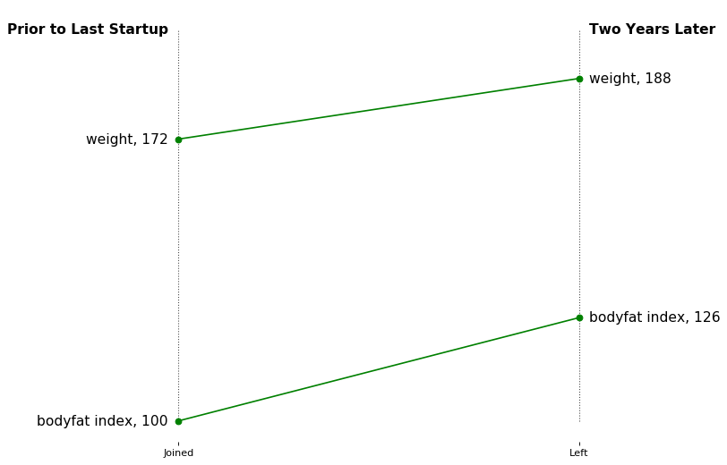
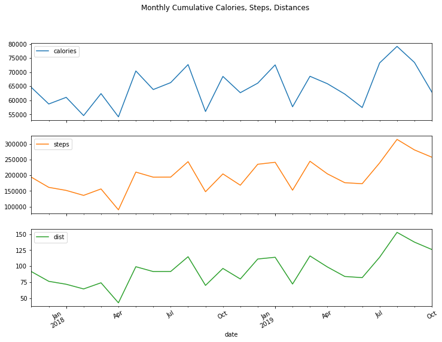
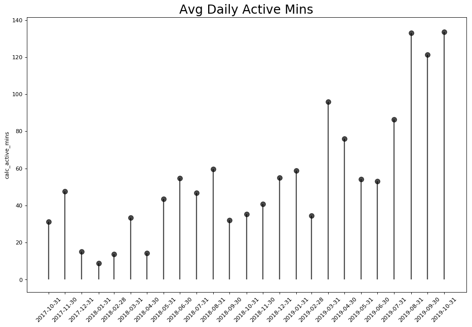
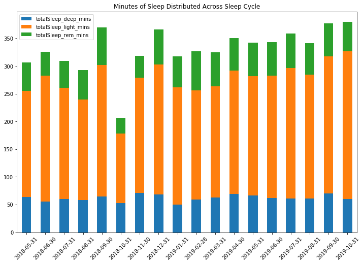

In the past year I have come to appreciate the rollercoaster of health and especially how it relates to the people I care about. All of that is a story for another day, but building a data-driven foundation and weaving it into the DNA of a company is my background. 

Soup to nuts, starting with infrastructure and developing baselines, mining for insights, to eventual experimentation, and then bringing it all together in order to drive transformational change is something I’m both proficient at and greatly enjoy. Do you see where I’m going with this?  

Given multiple health setbacks, even with the limited data I currently had, it was alarming to see how things had gone off the rails, while also amazing seeing the plethora of data sources available these days.  I'm including most sources in this post, with the exception of the genome sequencing I did from this post as that's extremely dense, confusing, and is out of scope for basic evaluation. 



If I could swap out the business for my body, would the same rules apply? Rule #1, it is much easier said than done….enjoy!

## Monthly Cumulative - Weekdays


```python
df_monthly[['calories', 'steps', 'dist', 'mins_sedant', 'hr_total_calories', 'mins_active_light', 'calc_active_mins', 'totalSleepMinutesAsleep', 'totalSleep_deep_mins', 'totalSleep_rem_mins', 'totalSleep_wake_mins', 'totalSleepTimeInBed']][df_monthly.index > '2017-07-31'].tail(10)
df_monthly.reset_index(inplace=True)
df_monthly[['date','calories', 'steps', 'dist']][df_monthly.date>'2017-11-01'].plot(subplots=True,x='date',figsize=(12,9), sharex=True, legend=True,title='Monthly Cumulative Calories, Steps, Distances')
```
After hooking into a few apis and a lot of data wrangling, we are prepared to start interpreting the results. A few quick plots around my wearable show the increase in activity for the past 3 months, but the data fluctuates.

Some quick plots around my wearable shows the increase in activity the past 3 months, but it (I) bounce around.




That’s all well and good, but cumulative monthly values are difficult for me to wrap my head around and bring into my day-to-day routine. Since my weekend schedule varies, I’ll remove the weekends and focus on the averages.


## Monthly Averages - Weekdays


This was rather promising to see since I have committed to improving my cardiovascular health due to the predisposition of heart disease in my family. I’m finally starting to see some progress which is extremely motivating!

Now I've hooked into quite a few disparate data platforms and munged them together.  I think a correlation plot, although visually intimidating at first, may be a good way start off developing an underestanding of this unfamiliar dataset and the inter-relationships among features.


It is interesting to see how sedentary minutes in addition to active minutes are directly correlated to my resting heart rate.

The active and sedentary minutes below exhibit the inverse relationship that one would expect, which is encouraging to see as that means we can start to trust this data a bit more (that’s not always the case and frequently causes challenges for data scientists after the fact).





### Let's Dive Into Sleep, What is Sleep Efficiency? 


As you can see above, the sleep efficiency metric doesn’t appear to correlate with sleep minutes. This number is a black box, and due to insufficient information in the calculation, I’m going to disregard it for now.


I have always suffered from severe insomnia, despite practicing good sleep hygiene in the past few months, I still haven’t felt like I’ve made significant progress. BUT, at first glance, it does seem to be stabilizing and sloping upward. Let’s analyze the findings.


If we zoom in a bit closer, I think we can see how much 'opportunity' there is; look at that daunting dotted line implying 8 hours!  I'm still no way near 8 hours (480 mins), which is quite troubling actually as there is more and more research out on the hazards to heath caused by sleep deprivation. 

This isn't very promising, but let's see if we can smooth it out over quarters. Now that's a bit more motivating!  I can take some solace in that there is some upward movement.  Hopefully this continues as I have a large hike up to 8 hours!  

Broadly things seem to improving, hopefully I can increase that slope quite a bit. 


Let's dig a bit deeper and see if we can get a bit more granular, particularly the <u>quality of sleep</u> as opposed to simply the total time.





The above gave us a weekly view, but I wonder if there is some variability within the week?


We can see a bit of variability, but the above doesn't really give us any idea of the variance aside from the means across our weekdays.

This calls for a box plot, a favorite of mine.


That's more desirable, the box plot is great here as if the box plot is short then that implies that our data is not very spread out (Wednesday).  Should the median value be closer to the bottom, then we know the distribution is mostly towards lower values and the whiskers really give us a much better idea of the variance and standard deviations.


## Next Let's Look At Some Vitals and Biomarkers!

    [<matplotlib.lines.Line2D at 0x1a8ef04be0>]


I have modified my diet a bit over the past 3 months and have included a b-complex supplement, which appears to be helping here:


Now let's get to the nitty gritty, glucose and lipid panels.


Taking a closer look, it seems like the glucose has improved based on my diet and exercise modifications!


Unfortunately, my cholesterol is increasing, which is not desirable to the high risk of advanced cardiovascular disease in my family.


Yikes....that LDL is no bueno


## Closing Remarks

After considerable research, I don’t have a conclusion rather than an extensive to-do list.  

That includes talking to my doctor particularly about my LDL levels and evaluating if I need to run more tests (I hear the LDL-p is a good metric).   

In addition, my wife is going to ensure I get evaluated by a sleep doctor and has threatened to drag me there herself if I don’t make that appointment ASAP.

Also, I did gain a set of average metrics across the week, particularly active minutes and hr_calories which I can use to ensure I keep my exercise and activity levels up.
 
P.S. 
These apis and 3rd party data sources were particularly messy, so I need to modularize my code a bit before posting to my repo, so it will be in there in a week or so!


