In the past year, I have really come to appreciate the rollercoaster of health both personally and how it relates to the people we care about.  All that is a story for another day, but building a data-driven foundation and weaving it into the DNA of an organization is my background.  Soup to nuts, starting with infrastructure and developing baselines, mining for insights, to eventual experimentation, and then bringing it all together in order to drive transformational change is something I'm both good at and enjoy greatly.  You see where I'm going with this?  

Given some health setbacks, even with the limited data I currently had, it seemed pretty obvious that things had gone off the rails.

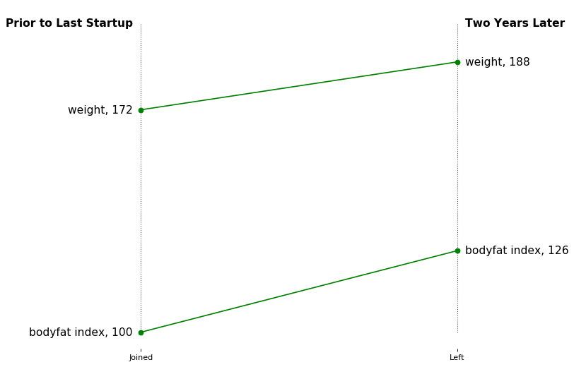

If I could swap out the business for my body, would the same rules apply?  First rule is that it is much easier said than done....enjoy!

## Monthly Cumulative - Weekdays


```python
df_monthly[['calories', 'steps', 'dist', 'mins_sedant', 'hr_total_calories', 'mins_active_light', 'calc_active_mins', 'totalSleepMinutesAsleep', 'totalSleep_deep_mins', 'totalSleep_rem_mins', 'totalSleep_wake_mins', 'totalSleepTimeInBed']][df_monthly.index > '2017-07-31'].tail(10)
df_monthly.reset_index(inplace=True)
df_monthly[['date','calories', 'steps', 'dist']][df_monthly.date>'2017-11-01'].plot(subplots=True,x='date',figsize=(12,9), sharex=True, legend=True,title='Monthly Cumulative Calories, Steps, Distances')
```
After hooking into a few apis and a lot of data wrangling, which took awhile, we're finally in a place to get started to see what we're working with.  

Some quick plots around my wearable shows the increase in activity the past 3 months, but it (I) bounce around.

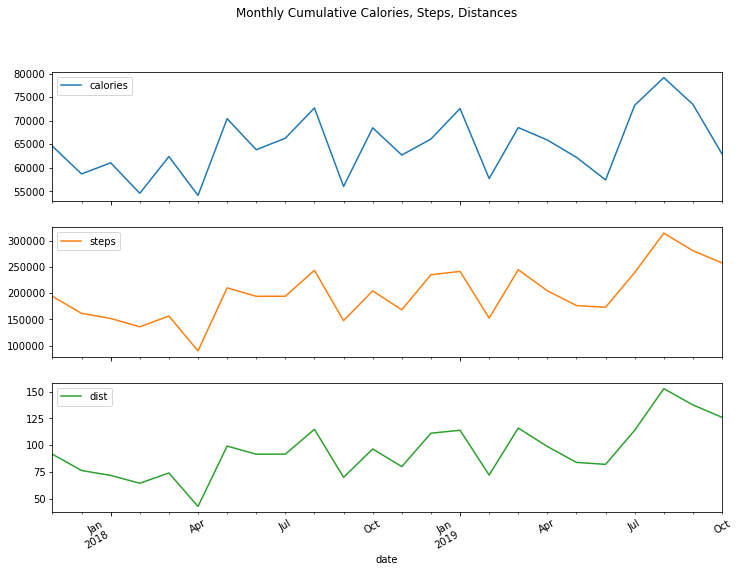

That's all well and good, but cumulative monthly values are difficult for me to wrap my head around and bring into my day-to-day.  Perhaps averages may be more interesting and I'll scrub out my weekends, as my weekends tend to be rather varied from week to week.

## Monthly Averages - Weekdays

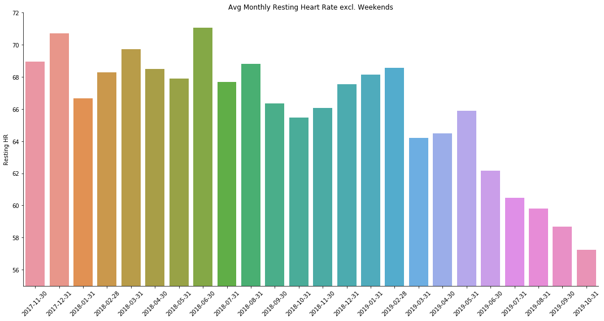

This was rather promising to see, as I've really committed to improving my cardiovascular health due to all the heart disease in my family and I'm finally starting to see some progress which is extremely motivating!

Now I've hooked into quite a few disparate data platforms and munged them together.  I think a correlation plot, although visually intimidating at first, may be a good way start off developing an underestanding of this unfamiliar dataset and the inter-relationships among features.


There is a lot of good stuff here, what is interesting to see here is that sendentary minutes in addition to active minutes seem pretty correlated to my resting heart rate.

These active and sedentary minutes below exhibit the inverse relationship that one would expect, which is great to see as then that means we can start to trust this data a bit more (that's not always the case and frequently cause a lot of headaches for data scientists later on).

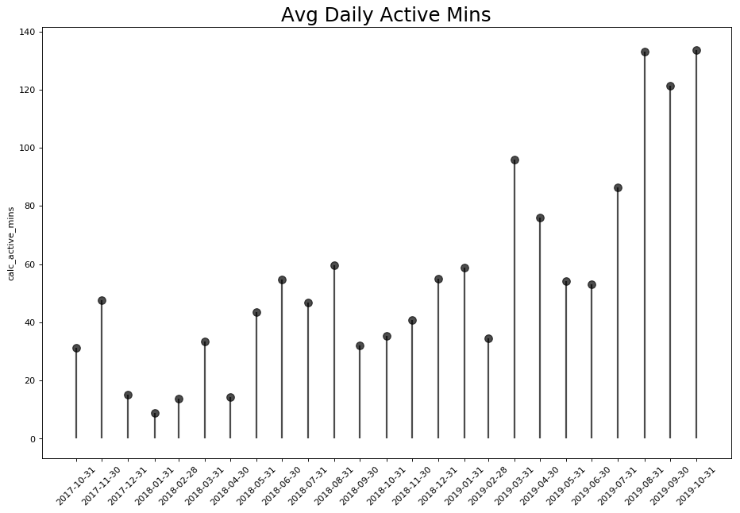

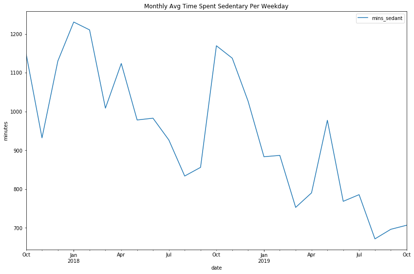


### Let's Dive Into Sleep, What is Sleep Efficiency? 

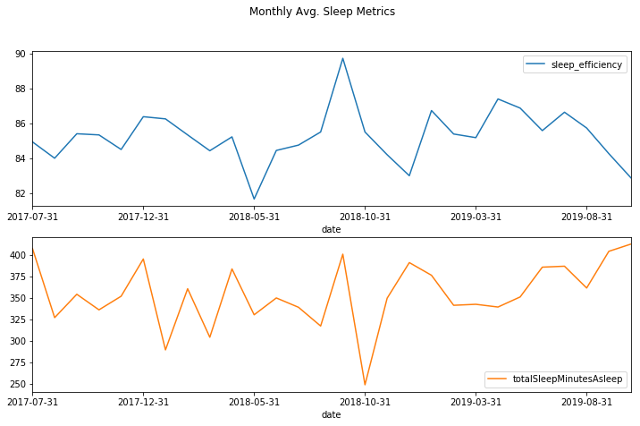

As you can see, the sleep efficiency metric doesn't appear to correlate to sleep minutes and I'm unsure what it means.  This number is a bit of a black box and due to insufficient information on the calculation I'm going to disregard it for now.

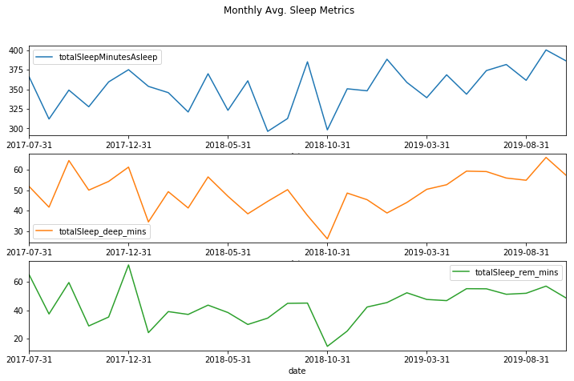

I have always suffered from terrible insomnia, and no matter how much sleep hygiene and tricks I still haven't made too much progress. BUT at first glance, it does seem to be stabilizing and sloping upward (although not very dramatically).

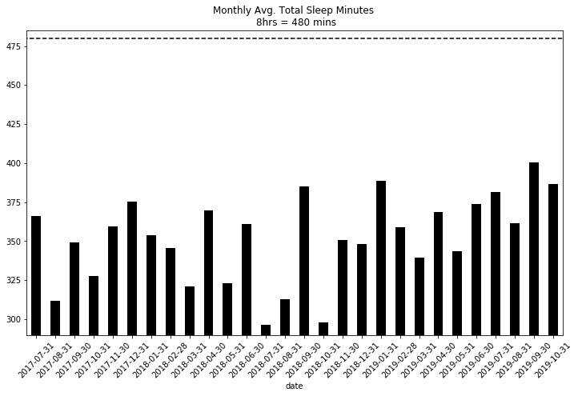

If we zoom in a bit closer, I think we can see how much 'opportunity' as I'm still no way near 8 hours, which is quite troubling actually.  There is more and more research out on the hazards to heath caused by sleep deprivation.

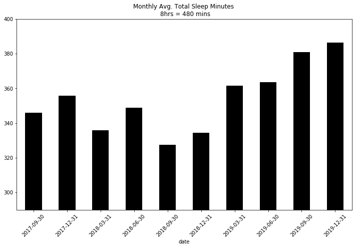

If I smooth it out over a quarter, I can take some solace in that there is some upward move.  Hopefully this continues as I have a large hike up to 8 hours!  

Broadly things seem to improving, hopefully I can increase that slope quite a bit. 

Let's dig a bit deeper and see if we can get a bit more granular, particularly the quality of sleep as opposed to simply the total time.

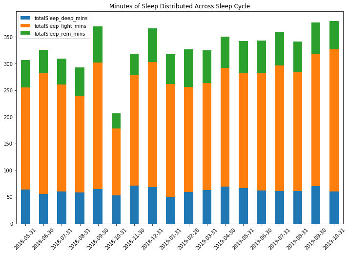

The above gave us a weekly view, but I wonder if there is some variability within the week?

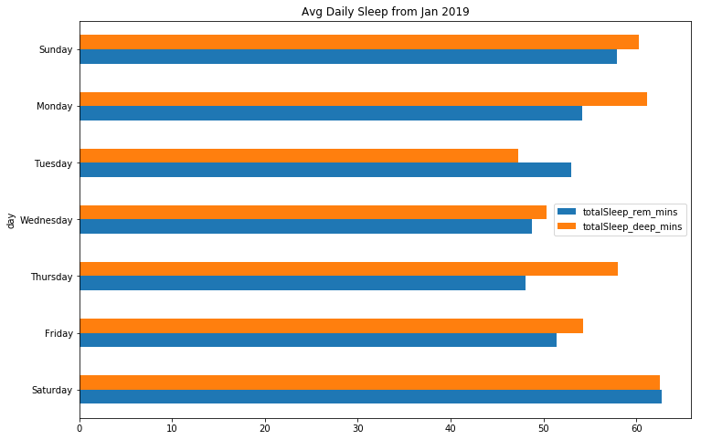

We can see a bit of variability, but the above doesn't really give us any idea of the variance aside from the means across our weekdays.


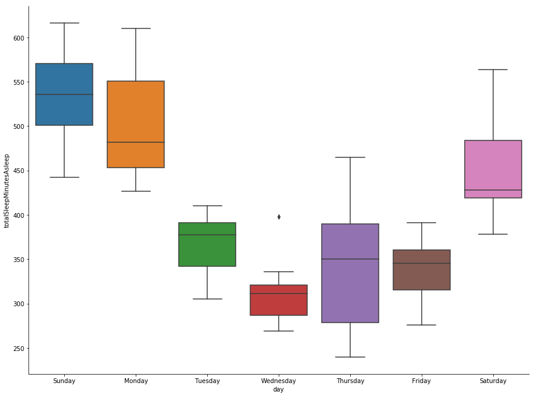

That's better, the box plot is great here as if the box plot is tall then that implies that our data is pretty spread out.  Should the median value be closer to the bottom, then we know the distribution is mostly towards lower values and the whiskers really give us a much better idea of the variance and standard deviations.


## Next Let's Look At Some Vitals and Biomarkers!


    [<matplotlib.lines.Line2D at 0x1a8ef04be0>]

I have modified my diet a bit and included a b-complex supplement, which appears to be helping here:

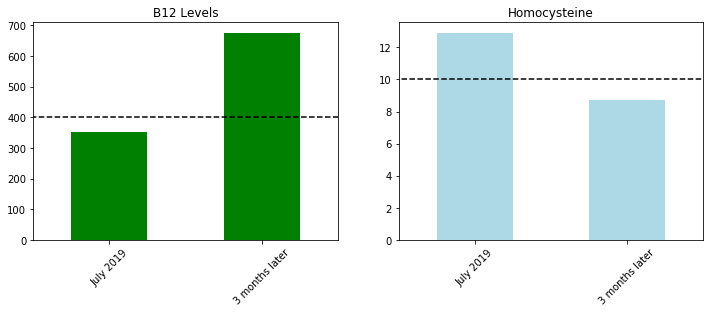

Now let's get to the serious stuff, glucose and lipid panels:


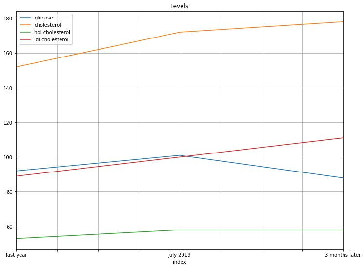

Taking a closer look, it seems like the glucose has improved based on my diet and exercise modifications!


But unfortunately my cholesterol seems to be getting worse, which is not good due to my high risk of cardiovascular disease.


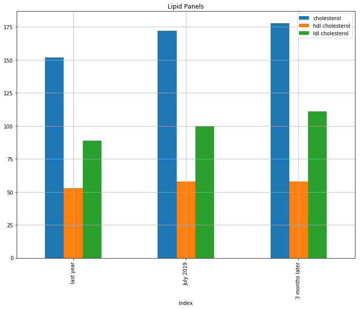

Yikes....

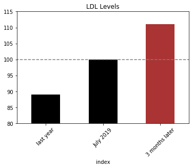


Well after all of that, I don't have a conclusion rather than a few more To-Dos :) 

These To-Dos definitely include talking to my doctor particularly about my LDL and evaluating if I need to run some more tests!  In addition, my wife is going to ensure I go to a sleep doctor and has threatened to drag me there herself if I don't make that appointment ASAP.

I did also gain a set of average metrics across week, particularly active minutes and hr_calories which can ensure I'm at least maintaining my momentum as I don't want that resting heart rate to start creeping back up.

But this was both a painful exercise and equally motivating as it's great to see progress as well as see things that don't "budge" as then you can run anotehr experiment or switch tactics.  

P.S. I know a few folks have asked for some of the underlying code, apologies as I need to modularize it a bit as some of the api formatting could use a cleanup.  I plan to do that by next week and will post it in the repo shortly after!


