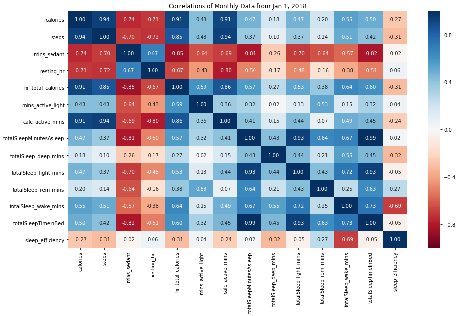
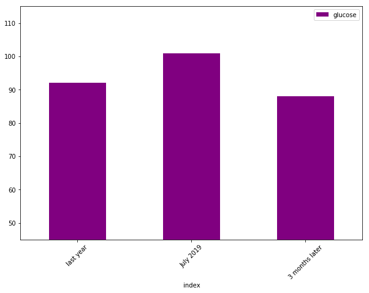

---
layout: post
title: Healthy Data Wrangling
date: '2019-10-28 12:07:25 +0000'
categories:
  - data
published: true
---

In the past year, I have really come to appreciate the rollercoaster of health both personally and how it relates to the people we care about.  It's been a rollercoaster of emotions: daunting, confusing, intimidating, saddening, madding, and even quite empowering.  All that is a story for another day, but building a data-driven foundation and weaving it into the DNA of an organization is my bread and butter; infrastructure, experimentation, mining for insights, and bringing it all together is what I love doing what I do.  I wondered if I could swapping out the business for my body?  Like most things, much easier said than done....enjoy!

## Monthly Cumulative - Weekdays


```python
df_monthly = df_master[~df_master.day.isin(['Saturday','Sunday'])].groupby(pd.Grouper(key='date', freq='M'))[cols_avg].agg('sum')
df_monthly[['calories', 'steps', 'dist', 'mins_sedant', 'hr_total_calories', 'mins_active_light', 'calc_active_mins', 'totalSleepMinutesAsleep', 'totalSleep_deep_mins', 'totalSleep_rem_mins', 'totalSleep_wake_mins', 'totalSleepTimeInBed']][df_monthly.index > '2017-07-31'].tail(10)
df_monthly.reset_index(inplace=True)
df_monthly[['date','calories', 'steps', 'dist']][df_monthly.date>'2017-11-01'].plot(subplots=True,x='date',figsize=(12,9), sharex=True, legend=True,title='Monthly Cumulative Calories, Steps, Distances')
```
After hooking into a few apis and a lot of data wrangling, we're finally in a place to get started to see what we're working with.  

Some quick plots around my wearable shows the increase in activity the past 3 months, but it (I) bounce around.


That's all well and good, but cumulative monthly values are difficult for me to wrap my head around, but perhaps weekday averages, as my weekends tend to be rather varied from week to week.

## Monthly Averages - Weekdays

This was rather promising to see, as I've really committed to improving my cardiovascular health due to all the heart disease in my family and I'm finally starting to see some progress which is extremely motivating!

Now I've hooked into quite a few disparate places and munged them together.  I think a correlation plat may be a good way start off developing an underestanding of this unfamiliar dataset and the inter-relationships among features.  


There is a lot of good stuff here, what is interesting to see here is that sendentary minutes in addition to active minutes seem pretty correlated to my resting heart rate.




These two exhibit the inverse relationship that we would expect, which is great to see as then that means we can start to trust this data a bit more (more on that later) .


## Let's dive Into Sleep

As you can see here, the sleep efficiency metric doesn't really seem to correlate to sleep minutes.  This number seems a bit of a black box and due to insufficient understanding I'm going to disregard it for now.


## Sleep Efficiency Is A Blackbox Number, Disregarding


## Now we got a broad view of things improving, albeit still very far from ideal!
### Let's dig a bit deeper


The above doesn't really give us any idea of the variance aside from the means across our weekdays.


That's better, the box plot is great here as if the box plot is tall then that implies that our data is pretty spread out.  Should the median value be closer to the bottom, then we know the distribution is mostly towards lower values and the whiskers really give us a much better idea of the variance and standard deviations.


## Next Let's Look At Some Vitals and Biomarkers!


    [<matplotlib.lines.Line2D at 0x1a8ef04be0>]





# What Ranges?
The big metrics to focus on are:
calc_active_mins, mins_sedant, hr_total_calories, steps, and sleep


