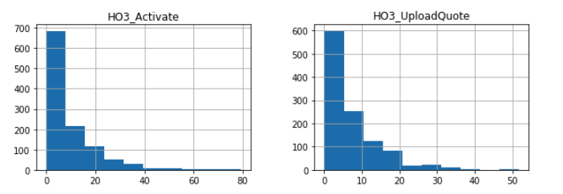
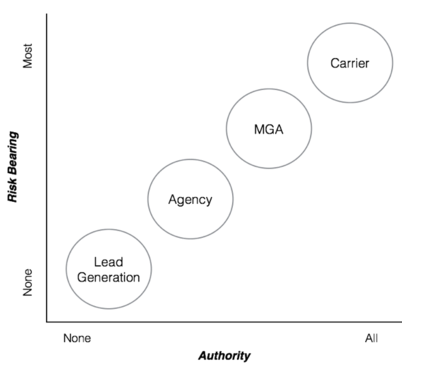
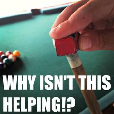

Reposted Legacy Post [here](https://internal-blog.bettercover.com/insurance-what-where-do-we-start/ "insurance link") 
So when Mr. Garg told me he wanted me to do insurance, particularly homeowners insurance…I had a think on it. I thought well he built an amazing mortgage company, so if he says we gotta do it I guess we gotta do it. Traditionally I work with tech companies on reinventing existing or pivoting into new business...so I’m used to a lot of ambiguity. Plus I thought: We actually ‘physically’ get insight into the home via an appraisal, so that data must be valuable in a data product.  

So I stepped away from my CRO position on the mortgage side and dove right into the insurance side head first. <b>Easy peasey, right?  Umm…not quite…not ever </b>

I always talk to my teams on developing frameworks for addressing ambiguity, as in: How do you solve a problem that isn’t defined? You instantly can become overwhelmed thinking, "What do we need to build vs buy? What’s an AMS, E-Rater, and 20 other confusing insurance services? Can we partner with someone who has this stuff? What team do we need? We have home appraisal data, but a lot is in pdfs? If I hire folks can I set them up to succeed if I don't know what to do? Wait how does insurance actually work? What’s a producer license? Is there a test for insurance licensing? How do we take examinations and what does fulfillment mean? Coverage B?  Why are property and casualty 2 separate exams in Jersey and 1 in NY"

The list goes on and on in a paralyzing fashion.  Say it's a lot like shooting pool; you just have to start moving………………pick a direction....any direction

I often use pool metaphors with my teams, albeit I know nothing about pool.  

In pool you start with what is called the ‘break.’ Then you start trying to take shots that don’t have an immediate return, but let you set up your potential 3rd, 4th, and 5th shots. As the game progresses you keep calibrating and considering your permutations of next shots.  Because there is one certainty: nothing will go according to plan.

So how to ‘break?’ Finding comfort in data was the first step. Swimming around the datalake and inspecting every activity I could find (never really looked post-lock before); I quickly realized there was a lot to learn on how our mortgage teams handle homeowners’ insurance (good to know as it made me aware of how complicated insurance is).  

See some fun graphs:

These are some of the timing (days) of certain insurance actions, which made me aware there are a lot of dependencies around the entire loan process and borrower timeline.  But the data below is essentially useless......more on that later

<ins>A few questions we considered after the "break":</ins>

a) How does the regulatory component of insurance work? More specifically, how do we do insurance legally?

b) How does our amazing operations team handle insurance in our post-lock mortgage flow? More specifically, what happens post-lock?

Let’s start with the regulatory framework:

We started asking a lot of questions to a lot of people in our network who introduced others in their networks, who could help shine some light on the space. On top of that we did a lot of reading/googling with every tidbit or keyword that came up in any conversation. The visual below is particularly helpful in defining the first common growth path, and four main entity structures, in the insurance space:

<ins>Post-Lock Mortgage Workflows</ins>

After a few weeks swimming around the datalake, I felt that I had done enough homework to earn the right to start asking questions. It always starts with people and process for highly intensive operational workflows and context/empathy is the most important thing; rather than simply rows and columns from a SQL query or a histogram from a python script.

We knew that property characteristics were important and the appraisal/valuation team was another stakeholder we needed to talk to as appraisal reports are particularly valuable in understanding the home. At that time this data was also a missing component in the Datalake. We spoke to Megan who guided us towards the relevant individuals in NYC and teams in India and talked to Joe in Product who helped navigate the tech-side of post-lock. Next we started modeling flows; combining some survey work with interviews and conversations with individuals and teams. I personally went to India and both leads on Insurance (Yash) and Appraisal (Bharat) took time out of their busy workdays (nights) to patiently walk me through their workflows in brutal detail; while I revised/rebuilt my flowcharts and documents N times (N>200) at 5am before dinner/breakfast with my new friend Jillian.   I quickly realized that their workflows needed to be completely rebuilt to support their current processes as it had been 1.5 years since last touched and at Better we move quickly. Our India teams have some truly amazing and talented folks – meeting in person drove home how thoroughly our teammates in Gurgaon drive Better's operational excellence.

After the India trip, I fully appreciated how closely our mortgage teams work with the insurance agents and how insurance entities (Agencies/MGAs/Carriers) have built out their own call centers with their own highly unique workflows. I knew we needed a great partner that had these insurance operations in place, and that we needed state licenses in order to handle any insurance related customer communication.

So,  after the initial 'break' our next few shots became clear

* We had to go down the agency path; which included taking the property and casualty exams (800-900 pages of study material varying by state) in order to get individual licenses, an entity license in 1 state, and a company to help us get reciprocity and licenses across all states
* Critical stakeholders to this initiative included the Better Mortgage appraisal and insurance teams
We needed to completely rethink and rebuild the insurance workflows to first and foremost support our operations teams current processes
* We needed an insurance partner that had an operations/call center, in addition to us having our own licensed folks to ensure a seamless integration with any insurance partner we have
* We needed both a licensed insurance function to facilitate communications and bottle-necked workflows and an engineering function capable of architect-ing around all the ambiguity of mortgage, the complexity of insurance partner integrations, and eventually the internal tools needed by the Better Cover Concierge (our working term for the Better Cover customer facing team)

Every day we learn more and the board keeps shifting and well sometimes it feels like:

And that’s how we’re developing the road-map; with Stuart and Ethan on-board full-time, I am confident we'll keep lining up new strategies for success as the table keeps shifting and thankful for the full support of Vishal Garg and senior leadership, particularly Erik Bern, Paula, Megan B., and Jerry.  

We'll keep you guys posted on our progress!

