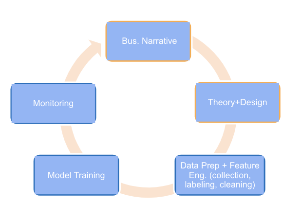
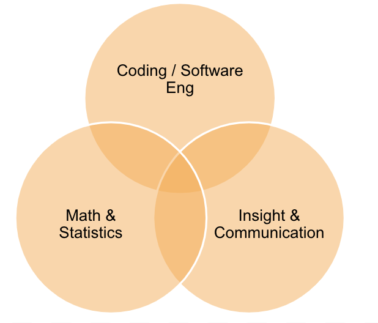
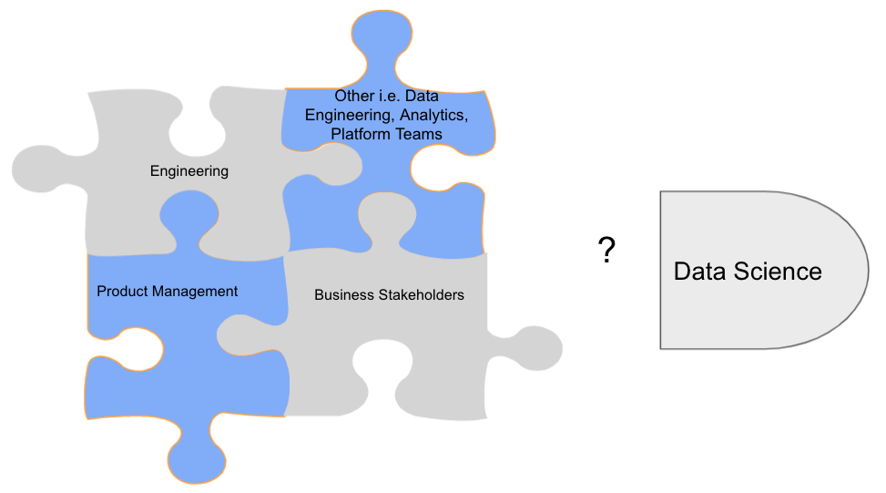
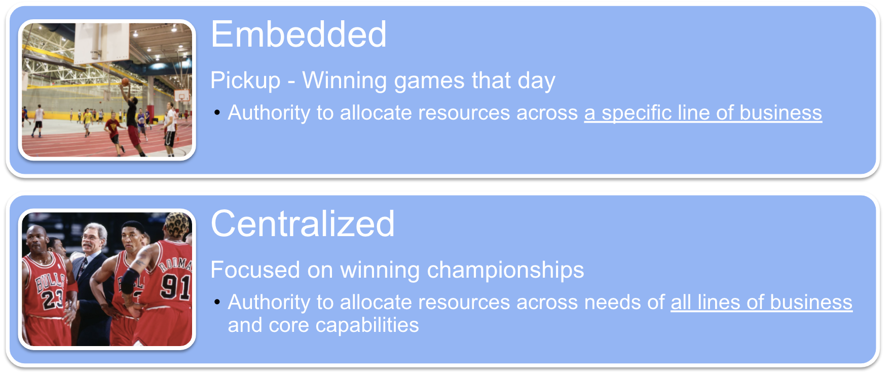
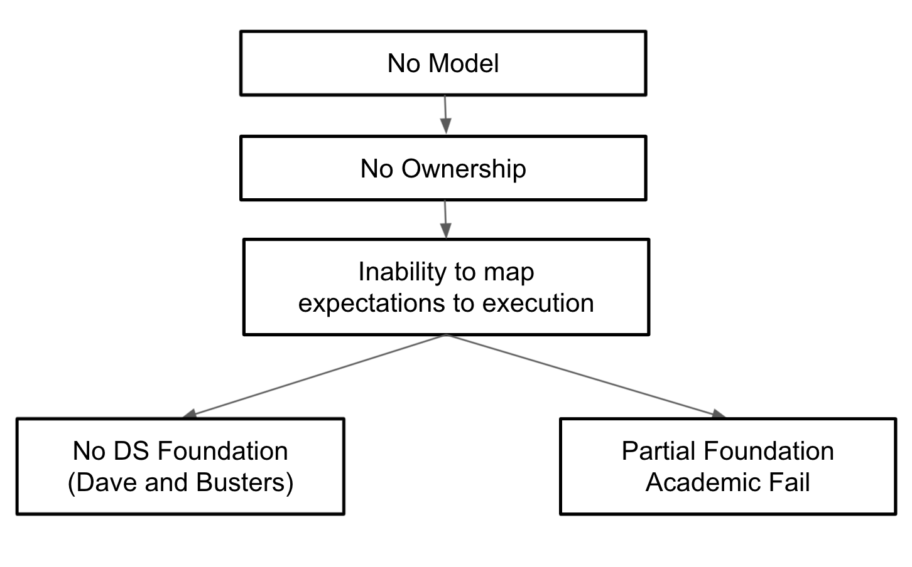
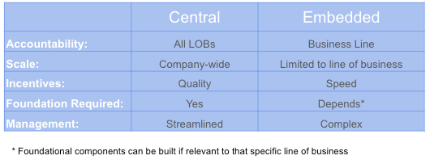

## Standing up a data science function at later stage startups often fails: here's a framework for success

OK, a startup just raised a large round focused on becoming more tech-enabled leveraging ML/AI with data science being core to future scalable growth. We have heard these stories many times, and almost every data scientist has seen these initiatives end in failure. The below is a framework to help get started on the right foot.

**What do you expect DS to do?**

In order to have a clear idea on the goals of establishing a DS function requires carefully evaluating what data-related teams and infrastructure are in place. For example, it is relatively common to assume the need for a DS function, when you would be better served with data management/platforming and BI/analytics; which is requires a dedicated post in itself.

Why? If the data is poorly structured, unstable, then 95% of the work will be messy non-scalable data reconciliation and ad-hoc patches/fixes. 

A data science team can be instrumental in helping transition to a state of data stability and moving towards being a data-driven organization. However, clarity on the state of data is crucial before building out a function to ensure expectations and resources can be aligned to ensure this initiative is set up for success. Now let's say that your data org is in a good place, and your objective for data science is to leverage data science to create production quality products.  Rather than insights and one-off analyses, Production quality requires reproducibility and scalability, requiring a much different foundation to ensure success.

<h2>What’s needed for a strong foundation?</h2>

- Core DS Workflow Capabilities

- Build out DS skills creating a well rounded DS team

- Establish the DS team - org model and ownership

---
**Build Core DS Workflow**

*Process:*  
Documentation and workflow standards across business narrative (problem statements) down to the technical nitty-gritty; simplicity and a centralized doc framework are crucial for startup data science. For example, N miscellaneous powerpoints should not serve as documentation, and DS teams keep powerpoints to a minimum.

*Architecture:*    
ML stack supporting three essential functions (many ML tools/platforms provide more than 1 of these functions).

- Feature Store - how we enrich and transform both internal and external 3rd party data

- Model Store - how we build and deploy DS products/models

- Monitoring Store - how we monitor and improve those products/models

---

**Core DS Skill Sets**

Startups without a properly established DS function often consist of a hacker skill set lacking both software engineering fundamentals and product chops leading to a continued accumulation of tech and data debt. Product chops and software engineering fundamentals are core requirements for building high-quality, impactful products, which need to be including in a resource/hiring plan.

---

**Where does data science fit in the current org?**

The above are table stakes; the number 1 reason cause of failure is ambiguous ownership and misaligned incentives across the organization.  Choosing an operating model for DS can help facilitate this crucial conversation with executive leadership. 

**Data Science Operating Models**

It is essential to commit to an operating model to ensure that incentives are aligned; as the business changes, this can be revisited if it's also mapped back to resource planning.

A basketball metaphor probably illustrates this best.

**What happens if you do not choose?**

Not choosing a model often results in one of the following 1 of two failed outcomes (extend the basketball metaphor):

Not choosing a model often results in one of the following 1 of two failed outcomes (extend the basketball metaphor):  
  

**Dave and Busters Arcade BBall Game**.  

Incentives to allocate resources:
- to the most influential business or exec at the time
- as quickly as possible whenever possible

This is not DS and run counter to any foundational work.  

         

**“Academic Fail”**

- DS solves for quality BUT business expects speed

- Work is deemed “academic”, foundation and team are both scrapped partially completed  
         
## Which Model To Choose?

**Why Centralize?**

Pros: 
- Global  - Bring data from all parts of company enabling a broader understanding of customer experience
- Streamlined Management - career paths, peers, mentorship, collaboration, and recruiting
- Accountability to DS - incentivizing resource allocation to include foundational DS 
- Scale - Uniform best practices, platform, and tools across lines of business, executives, and products

Early Cons:
- Quality over Speed
- Difficult for managing business lines of at very different stages and needs

**Why Embed?**

Pros:
- Local – customized to accommodate needs for business lines in different stages of development
- Accountability to business line - incentivizes resource allocation focused on unique needs of individual business line

Cons:
- Speed over quality 
- Complex Management - career paths, peers, mentorship, collaboration, and recruiting
- Doesn’t Scale - lacking standardization across all lines of businesses

**Embed vs. Centralize:**

## Putting it all together
Successfully standing up a data science function at a later stage startup is a complicated endeavor as every startup is different in addition to its goals for establishing a DS team.  In this case the fucntion's objective is to leverage data science to create production quality products.  A good place to start is establishing:
- process and infrastructure to support a DS workflow 
- team skillsets including product and software engineering chops 
- most importantly: establishing where DS fits into the org and an operating model that ensures the ability to map execution to business expecations
